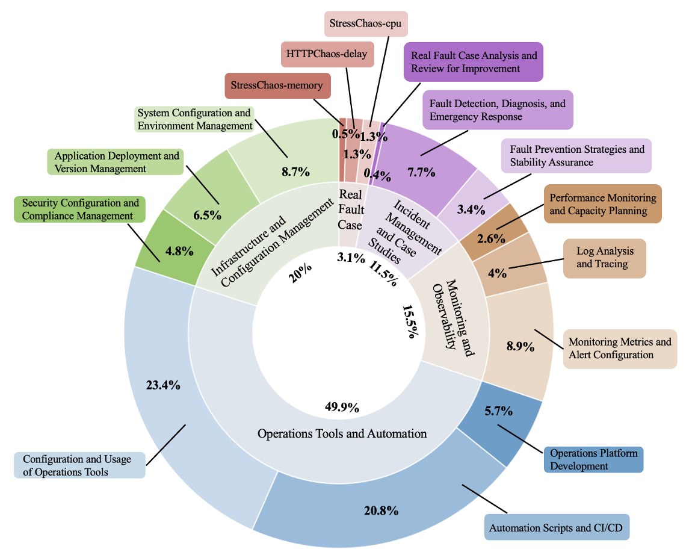

# Construction of Operations Dataset

## Our fine-tuning dataset (19,232 records)

### 1. Infrastructure and Configuration Management
- **1.1** System configuration and environment management (operating system, network, storage, cloud platform)  
- **1.2** Application deployment and version management  
- **1.3** Security configuration and compliance management  

### 2. Operations Tools and Automation
- **2.1** Configuration and usage of operations tools  
- **2.2** Automation scripts and CI/CD  
- **2.3** Operations platform development  

### 3. Monitoring and Observability
- **3.1** Monitoring metrics and alert configuration  
- **3.2** Log analysis and distributed tracing  
- **3.3** Performance monitoring and capacity planning  

### 4. Incident Management and Case Practices
- **4.1** Failure prevention strategies and stability assurance  
- **4.2** Failure detection, diagnosis, and emergency response  
- **4.3** Real-world incident analysis and postmortem improvement  

### 5. Real Fault Case
- **5.1** StressChaos-cpu  
- **5.2** HTTPChaos-delay  
- **5.3** StressChaos-memory  

## Data Sources

From the perspective of data sources, the dataset we constructed involves the following types:
1. Public web data  
2. Official software manual  
3. Open-source community issues  
4. Data extracted from real operations platforms

# Construction of AIOpsLLM

**Base Model:** Qwen2.5-14B-Instruct  
**Hardware:** NVIDIA A40 48GB ×6  

We tested our model in software configuration and operations scenarios, including software installation, usage of operational commands, fault detection, and fault repair:

| Metric | Qwen2.5-14B-Instruct | Qwen3-32B | Our Model |
|--------|---------------------|------------|-----------|
| ROUGE-1 | 0.2240 | 0.2329 | **0.3680** |
| ROUGE-2 | 0.0529 | 0.0500 | **0.1822** |
| ROUGE-L | 0.1253 | 0.1104 | **0.2363** |
| ROUGE-Lsum | 0.1878 | 0.1818 | **0.3215** |
| BLEU | 3.7410 | 2.4279 | **9.4529** |
| BERTScore Precision | 0.8197 | 0.8210 | **0.8631** |
| BERTScore Recall | 0.8462 | 0.8424 | **0.8752** |
| BERTScore F1 | 0.8327 | 0.8315 | **0.8686** |

# Statement
Our model is currently only at version 1.0 and will continue to be iteratively improved. Therefore, it cannot yet be guaranteed to achieve state-of-the-art performance on operations-related tasks.

The specific model weight files can be referred to at:https://gitlink.org.cn/devresilops/AIOpsLLM-14B-1.0